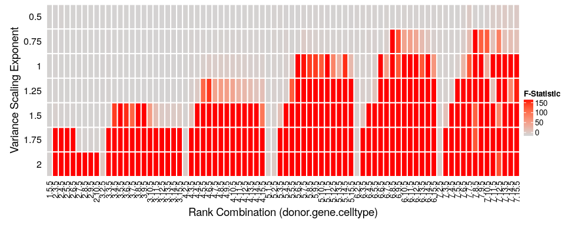
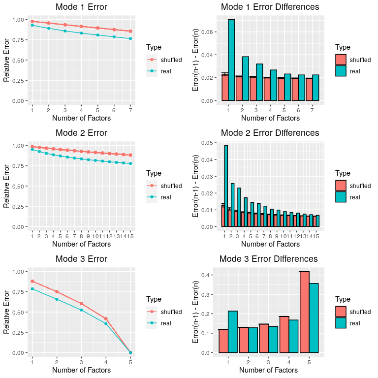
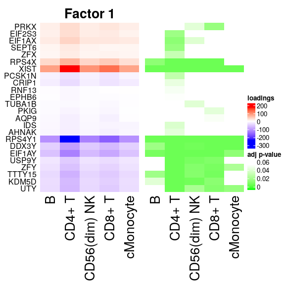
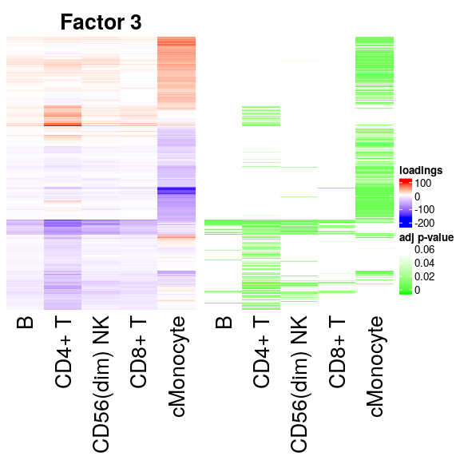
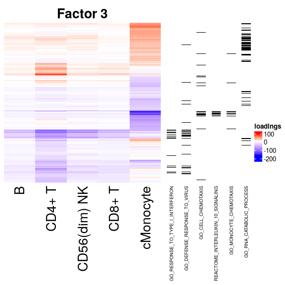

<!-- README.md is generated from README.Rmd. Please edit that file -->

# scITD

<!-- badges: start -->

<!-- badges: end -->

Single-Cell Interpretable Tucker Decomposition (scITD) employs the Tucker tensor decomposition to extract multi-cell type expression programs from single-cell RNA-sequencing data.

## Installation

You can install scITD with:

``` r
# install.packages("devtools")
devtools::install_github("j-mitchel/scITD")
```

## Walkthrough

Load the package.

``` r
library(scITD)
```

Load a dataset to use. Here, we’re going to analyze PBMC’s from 45
donors already stored in a Seurat object. The object must have metadata
columns including “donors”, “sex”, and “ctypes”. The raw data can be
found here:
<https://genenetwork.nl/scrna-seq/>

``` r
pbmc <- readRDS(file.path(find.package('scITD'),'data','PBMC_vanderwijst_clean.rds'))
```

Sometimes, as in this dataset, the genes are labeled with identifiers
other than the official gene symbols. If this is the case, we need to
provide a dataframe to convert gene identifiers to gene symbols because
much of this package’s functionality relies on having gene
symbols.

``` r
feature.names = read.delim(file.path(find.package('scITD'),'data','genes.tsv'),
                           header = FALSE,
                           stringsAsFactors = FALSE)
```

Next, we need to set up a project container that will hold all of our
raw data as well as results. The scMinimal object is a sub-container
that holds gene expression counts and metadata. The container object
holds sub-containers and results. When instantiating a new project
container, it is necessary to specify the experiment parameters
ctypes\_use, scale\_var, rotate\_modes, ncores, and rand\_seed. The
gn\_convert parameter contains the above dataframe with gene name
conversions. The ctypes\_use parameter should contain the names of the
cell types to use in all of the analysis. The scale\_var and
rotate\_modes parameters will be explained below.

``` r
pbmc_scMinimal <- seurat_to_scMinimal(pbmc)
pbmc_container <- make_new_container(pbmc_scMinimal,
                                     ctypes_use = c("CD4+ T", "cMonocyte", "B",
                                                  "CD8+ T", "CD56(dim) NK"),
                                     gn_convert = feature.names,
                                     scale_var = T,
                                     rotate_modes = 'donors',
                                     ncores = 30, rand_seed = 10)
```

Next, we identify genes which are significantly variably expressed
across donors within each cell type. The get\_ctype\_vargenes() function
first partitions the main gene by cell data matrix into per-cell type
matrices. It then computes the significantly variable genes via one of
two methods. By setting method to “anova”, basic anova is run for each
gene with groups defined by the donors that each cell belongs to. The
method, ‘empir’, uses an empirical approach that first collapses the
gene by cell matrices into gene by donor matrices (by calculating
average expression across all cells belonging to a donor) and computing
variance in these average expression values across donors. It then
computes pvalues based on the variance observed when cell to donor
linkages are shuffled. Regardless of the method, this function also
reduces the expression data matrices down to just those genes found to
be significantly variable in any cell type as our tensor will need to
contain the same genes from each cell
type.

``` r
pbmc_container <- get_ctype_vargenes(pbmc_container, method="empir", thresh=0.01)
#> [1] "CD4+ T"
#> [1] "cMonocyte"
#> [1] "B"
#> [1] "CD8+ T"
#> [1] "CD56(dim) NK"
```

When constructing the tensor for Tucker decomposition, we simply stack
the collapsed gene by donor matrices (for each cell type) to form the
tensor. However, we can enhance Tucker’s ability to extract biological
signal by properly scaling expression values in the tensor. For a given
collapsed matrix, we recommend applying a variance scaling procedure
whereby the variance for each gene across donors is first scaled to unit
variance. Then, we multiple the unit scaled values by the gene’s
normalized variance, where normalized variance is the variance after
taking into account the gene-variance trend. We can enhance the signal
extraction by applying an exponent to the normalized variance before
multiplying. To get an idea for what value of the exponent to use we run
the following function and plot its
results.

``` r
pbmc_container <- optimize_var_scale_power(pbmc_container, max_ranks_test=c(7,15,5))
#> [1] 0.5
#> [1] 0.75
#> [1] 1
#> [1] 1.25
#> [1] 1.5
#> [1] 1.75
#> [1] 2
pbmc_container$plots$var_scale_plot
```



This figure shows us the values of the var\_scale\_power parameter that
yield a Tucker decomposition with a factor highly associated with donor
sex metadata. Since we know that a handful of genes are highly
associated with donor sex, this should be one of the extracted results.
Therefore, we can see that an exponent of ~1.25 reliably extracts this
factor when we do Tucker decomposition to at least 5 donor factors and
at least 6 gene factors. Therefore, we should go ahead and set this
scaling parameter as
follows.

``` r
pbmc_container <- set_experiment_params(pbmc_container, var_scale_power = 1)
```

To run Tucker, we have to specify the number of factors (ranks) to get
out for each mode of the tensor (donors, genes, ctypes). This is a
fairly important specification as it will determine the number of
multi-cell type processes we get and their quality. To get an idea for
the proper number of ranks we implemented a method that computes svd for
the tensor unfolded along each mode separately. The reconstruction
errors from the svd (to varying numbers of ranks) are compared to
reconstruction errors from a tensor generated on shuffled cell to donor
linkages. This can allow us to see how reconstruction error changes when
the signal is purely
noise.

``` r
pbmc_container <- determine_ranks_tucker(pbmc_container, max_ranks_test=c(7,15,5),
                                 method='svd', num_iter=10)
#> Warning in qt(conf.interval/2 + 0.5, datac$N - 1): NaNs produced

#> Warning in qt(conf.interval/2 + 0.5, datac$N - 1): NaNs produced

#> Warning in qt(conf.interval/2 + 0.5, datac$N - 1): NaNs produced
pbmc_container$plots$rank_determination_plot
```



From these plots we can see that the proper number of donor ranks is
somewhere around 5 and the proper number of gene ranks is around 7 or 8
(donor mode is mode 1 and gene mode is mode 2). The number of ctype
ranks should just be set at the maximum (5 in this case, as there are
only 5 cell types). Therefore we will run Tucker with ranks set to
c(5,8,5).

We are finally ready to run Tucker and analyze the interesting
biological variation present in our dataset\! To run the decomposition
simply run the following
line.

``` r
pbmc_container <- run_tucker_ica(pbmc_container, ranks=c(5,8,5), shuffle=F)
```

Next, we will plot the donor scores matrix that tells us the amount of
each factor (aka multi-cell type process) present in each donor.

``` r
pbmc_container <- plot_donor_matrix(pbmc_container, meta_vars=c('sex'),
                                    cluster_by_meta='sex')
pbmc_container$plots$donor_matrix
```


When plotting the donor sex metadata next to the donor scores matrix we
can immediately see that one factor was pulled out that corresponds to
this variable. This further validates our optimization of the
var\_scale\_power parameter selected above. One thing to note is that
these factor scores have had ICA applied to them in order to rotate them
toward independence. This helps with interpretability, as it ensures the
factors are not correlated with each other. We enforced this behaviour
when we set the rotate\_modes parameter to ‘donors’ during instantiation
of the project container. Also to note, when ICA is applied, the core
tensor gets recalculated to reflect the applied rotation in the loadings
as well.

Now it’s time to look at our extracted factor loadings (multi-cell type
processes).

``` r
pbmc_container <- get_all_lds_factor_plots(pbmc_container)
render_all_lds_plots(pbmc_container$plots$all_lds_plots)
```


We can notice that the loadings plot which corresponds to the sex-linked
factor only has a handful of genes that are highly loading. This is to
be expected as there are only a few genes with a strong association to
this variable. We can also notice some interesting patterns in some of
the plots. In some cases multiple cell types have similar loadings
patterns, while one or two of the other cell types have a different
loadings pattern. On a high level, this would indicate that the process
represented by those factors has cell types that are jointly enacting
divergent biological functions.

Next, it will be useful to determine which genes from each cell type are
significantly associated with each factor. For this, we implemented a
jackstraw-like approach that samples fibers from the tensor randomly
along the donor mode and shuffles them. These shuffled fibers are used
to generate null statistics after doing Tucker and computing
associations between the shuffled fibers and donor scores. The null
statistics can then be used to get pvalues, and this is done the same
way as in the original jackstraw
method.

``` r
pbmc_container <- run_jackstraw(pbmc_container, n_fibers=200, n_iter=1000)
```

Let’s now look at the loadings plot for the sex-linked factor restricted
to just the significant genes.

``` r
pbmc_container <- plot_loadings_annot(pbmc_container, factor_select=1,
                                        use_sig_only=T, annot='sig_genes',
                                        sig_thresh=0.05, display_genes=T)
pbmc_container$plots$single_lds_plot
```



We can see that the method identified several X-linked and Y-linked
genes. Now let’s look at the loadings from a more biologically
interesting factor.

``` r
pbmc_container <- plot_loadings_annot(pbmc_container, factor_select=3,
                                        use_sig_only=T, annot='sig_genes',
                                        sig_thresh=0.05, display_genes=F)
pbmc_container$plots$single_lds_plot
```



We can see that within this process there appears to be similar genes
involved in all cell types except for the cMonocytes that express a
unique and mostly non-overlapping set of genes.

To see what biological pathways are enriched in the highly loading
cMonocyte genes, we can apply gsea as follows.

``` r
gsea_res <- run_fgsea(pbmc_container, factor_select=3,
                      "cMonocyte", db_use=c("GO","Reactome"),
                      num_iter=10000)
#> [1] "Enriched in positive loading genes"
#>                                         pathway       padj      NES
#>  1: REACTOME_EUKARYOTIC_TRANSLATION_ELONGATI... 0.01013052 3.465823
#>  2: REACTOME_EUKARYOTIC_TRANSLATION_INITIATI... 0.01043241 3.453803
#>  3: REACTOME_RESPONSE_OF_EIF2AK4_GCN2_TO_AMI... 0.01013052 3.409008
#>  4: GO_COTRANSLATIONAL_PROTEIN_TARGETING_TO_... 0.01013052 3.397676
#>  5: GO_NUCLEAR_TRANSCRIBED_MRNA_CATABOLIC_PR... 0.01013052 3.395457
#>  6:        REACTOME_NONSENSE_MEDIATED_DECAY_NMD 0.01013052 3.387912
#>  7:            GO_PROTEIN_TARGETING_TO_MEMBRANE 0.01043241 3.374874
#>  8:        REACTOME_SELENOAMINO_ACID_METABOLISM 0.01013052 3.355063
#>  9: GO_NUCLEAR_TRANSCRIBED_MRNA_CATABOLIC_PR... 0.01043241 3.342820
#> 10:                    REACTOME_RRNA_PROCESSING 0.01043241 3.321426
#> [1] ""
#> [1] "Enriched in negative loading genes"
#>                                         pathway        padj       NES
#>  1:           REACTOME_INTERLEUKIN_10_SIGNALING 0.002942894 -2.222678
#>  2:                     GO_NEUTROPHIL_MIGRATION 0.002942894 -2.179100
#>  3:                    GO_GRANULOCYTE_MIGRATION 0.002942894 -2.146158
#>  4:                GO_RESPONSE_TO_INTERLEUKIN_1 0.002942894 -2.133599
#>  5:                     GO_LEUKOCYTE_CHEMOTAXIS 0.002942894 -2.079943
#>  6:              GO_MYELOID_LEUKOCYTE_MIGRATION 0.002942894 -2.072818
#>  7:      GO_CYTOKINE_MEDIATED_SIGNALING_PATHWAY 0.002942894 -2.044539
#>  8:                          GO_CELL_CHEMOTAXIS 0.002942894 -2.036241
#>  9:     GO_CELLULAR_RESPONSE_TO_BIOTIC_STIMULUS 0.002942894 -2.034538
#> 10: REACTOME_CHEMOKINE_RECEPTORS_BIND_CHEMOK... 0.002942894 -2.026916
```

Likewise we can see what pathways are enriched in the highly loading
genes for CD4+ T cells in this factor.

``` r
gsea_res <- run_fgsea(pbmc_container, factor_select=3,
                      "CD4+ T", db_use=c("GO","Reactome"),
                      num_iter=10000)
#> [1] "Enriched in positive loading genes"
#>                                pathway       padj      NES
#> 1: GO_T_CELL_DIFFERENTIATION_IN_THYMUS 0.03903057 2.111547
#> 2:          GO_CYTOPLASMIC_TRANSLATION 0.03903057 2.061215
#> 3:                GO_RIBOSOME_ASSEMBLY 0.04091153 2.020055
#> [1] ""
#> [1] "Enriched in negative loading genes"
#>                                         pathway        padj       NES
#>  1:            GO_RESPONSE_TO_TYPE_I_INTERFERON 0.006765631 -2.436450
#>  2:    REACTOME_INTERFERON_ALPHA_BETA_SIGNALING 0.006765631 -2.414553
#>  3:               REACTOME_INTERFERON_SIGNALING 0.006765631 -2.404060
#>  4:                GO_DEFENSE_RESPONSE_TO_VIRUS 0.006765631 -2.379461
#>  5: REACTOME_ANTIVIRAL_MECHANISM_BY_IFN_STIM... 0.006765631 -2.310600
#>  6:                        GO_RESPONSE_TO_VIRUS 0.006765631 -2.274220
#>  7: GO_NEGATIVE_REGULATION_OF_VIRAL_GENOME_R... 0.006765631 -2.229442
#>  8: GO_NEGATIVE_REGULATION_OF_VIRAL_LIFE_CYC... 0.006765631 -2.229275
#>  9: GO_REGULATION_OF_VIRAL_GENOME_REPLICATIO... 0.006765631 -2.217460
#> 10:     GO_NEGATIVE_REGULATION_OF_VIRAL_PROCESS 0.006765631 -2.217075
```

We can see that the two cell types are mostly enriched for different
pathways as expected with the exception of interferon response.

Finally, we can plot some genes sets of interest next to the loadings
plot for this factor.

``` r
gene_sets <- c("GO_RESPONSE_TO_TYPE_I_INTERFERON",
               "GO_DEFENSE_RESPONSE_TO_VIRUS",
               "GO_CELL_CHEMOTAXIS",
               "REACTOME_INTERLEUKIN_10_SIGNALING",
               "GO_MONOCYTE_CHEMOTAXIS",
               "GO_RNA_CATABOLIC_PROCESS")

# highlight genes in pathways - limit heatmap to significant genes only
pbmc_container <- plot_loadings_annot(pbmc_container, factor_select=3,
                                      use_sig_only=T, annot='pathways',
                                      pathways=gene_sets, sig_thresh=0.05,
                                      display_genes=F)
pbmc_container$plots$single_lds_plot
```


